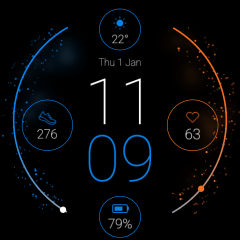
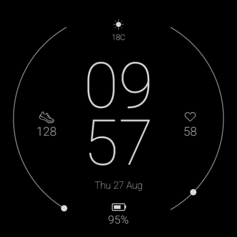

# Minimal Active Fizz - a Wear OS watch face

A minimal digital watch face for Wear OS 4+ (built and tested on the Google
Pixel Watch 4). Big stacked digital time, a date under a weather circle, and
four complications - weather, steps, heart rate, battery - framed by two
data-bound arcs (steps and heart rate) with a subtle blue/orange particle
"fizz". Fully color-free, burn-in-safe ambient mode.

## Install it (easiest)

Hand this whole folder (or the release URL) to a coding agent and say:
**"Follow AGENT.md to install this watch face on my Pixel Watch."**

The agent needs only `adb` (Android platform-tools) and your watch in Wireless
debugging mode - see `AGENT.md` for the exact steps. A prebuilt APK
(`active-fizz.apk`) is included, so no build is required.

To do it yourself: enable Wireless debugging on the watch, then
`adb pair`/`adb connect`/`adb install -r active-fizz.apk`, and pick Minimal Active Fizz from the
watch-face carousel. Full commands are in `AGENT.md`.

## Contents

- `active-fizz.apk` - prebuilt, debug-signed. Sideload to a Wear OS 4+ watch.
- `AGENT.md` - step-by-step setup + install instructions for an AI agent.
- `watchface/` - the full source (Watch Face Format XML + Gradle project) if you
  want to rebuild or customize.
- `preview/` - screenshots (active + ambient).

## Notes

- Debug-signed for personal sideloading; not a Play Store build.
- Heart rate and steps populate on-wrist (grant BODY_SENSORS + ACTIVITY_
  RECOGNITION, per AGENT.md). Weather comes from the system weather provider.
- Tapping complications opens the related screen (heart rate, battery settings,
  steps). Weather is not tappable (WFF has no weather launch target).
